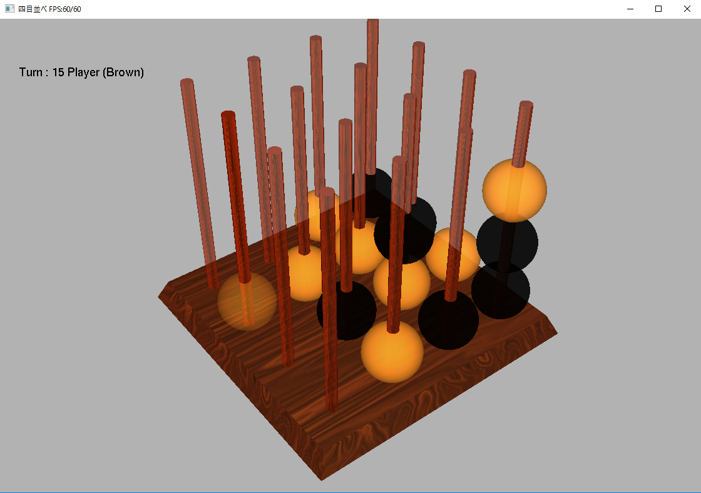

立体四目並べAI
=======

立体四目並べというゲームのAI開発用のプラットフォームです。

[立体四目並べ](https://ja.wikipedia.org/wiki/%E5%9B%9B%E7%9B%AE%E4%B8%A6%E3%81%B9#.E7.AB.8B.E4.BD.93.E5.9B.9B.E7.9B.AE.E4.B8.A6.E3.81.B9)は四目並べを３次元に拡張したゲームです。shimokuのプロジェクトファイルは人間vs人間（普通に遊ぶ用）、人間vsAI（展示用）、AIvsAI（棋譜蓄積用）の三つを行うためのプラットフォームを提供します。AIはDLLとして提供され、そのサンプルはRandomChoiceプロジェクトです。freeglutを利用しているのでコンパイル時にfreeglutが必要です。

マウスで視点を操作し、人間が遊ぶ場合は矢印キーで移動してエンターで決定です。AI用のDLL開発時はRancomChoiceプロジェクトのplugin.cppのthink関数を実装します。
